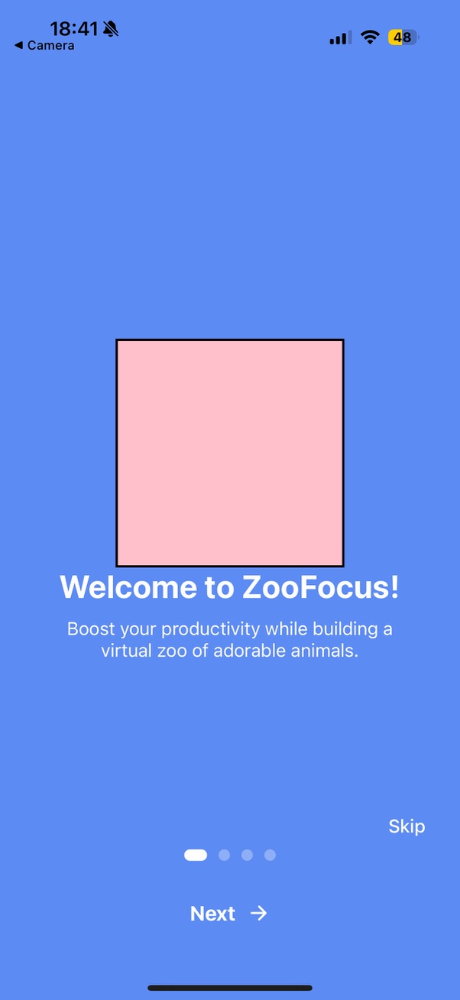
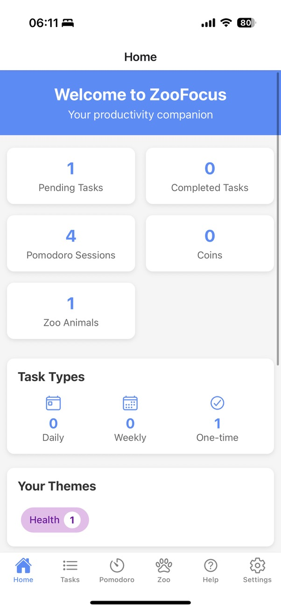
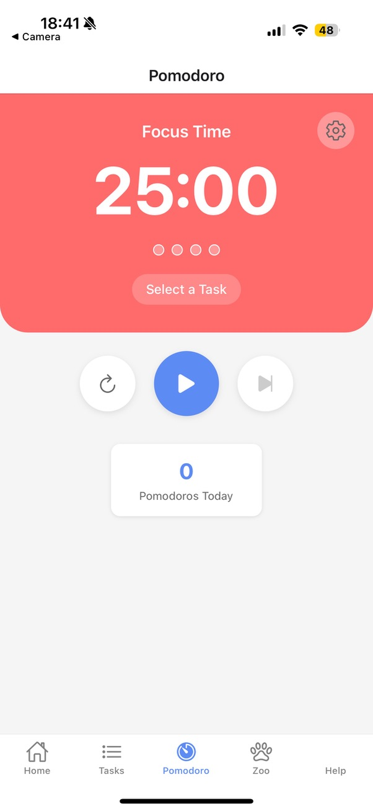
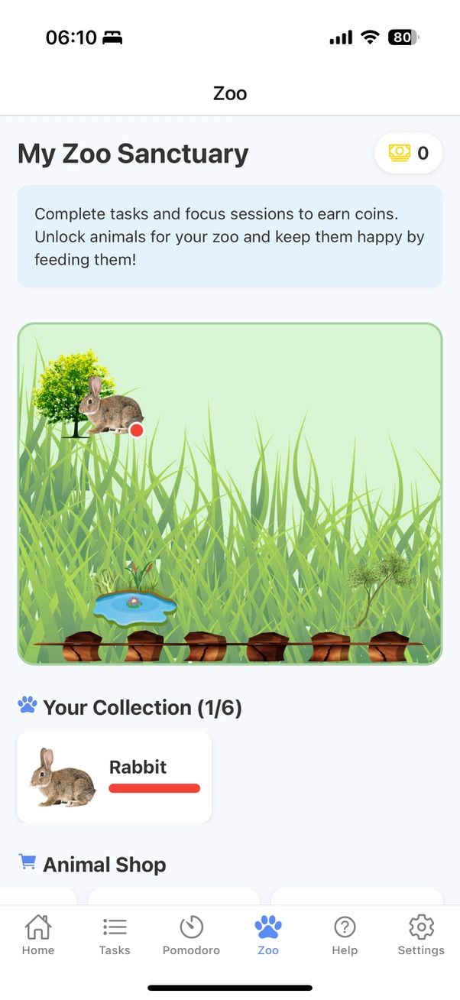
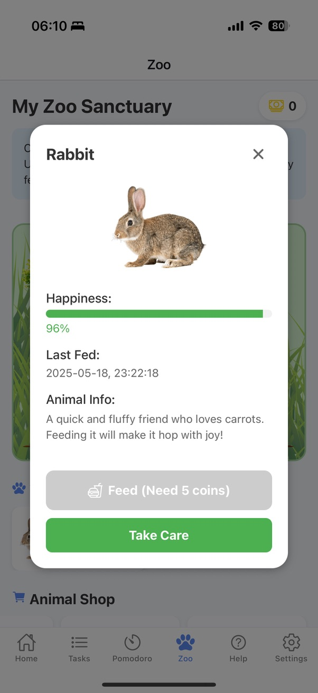

# 📱 Student Productivity App (Gamified)

En React Native-app byggd med Expo som hjälper studenter att plugga effektivare genom att kombinera produktivitetsverktyg med gamification.

## ✨ Features
* **Pomodoro Timer:** Fokusera i intervaller för maximal effektivitet.
* **Task Management:** Skapa och hantera att-göra-listor.
* **The Zoo (Gamification):** Slutför uppgifter och fokus-sessions för att låsa upp och samla på djur i ditt digitala zoo.
* **Persistens:** All data sparas lokalt på enheten via Async Storage.

## 🛠 Tech Stack
* **Framework:** React Native (Expo SDK 52)
* **Navigation:** React Navigation (Bottom Tabs)
* **State Management:** React Context API (`TaskContext`, `ZooContext`)
* **Storage:** AsyncStorage
* **Språk:** JavaScript

## 🚀 Hur man kör projektet
1.  Klona repot:
    ```bash
    git clone [https://github.com/zacharyofsweden/student-productivity-app.git](https://github.com/zacharyofsweden/student-productivity-app.git)
    ```
2.  Installera dependencies:
    ```bash
    cd frontend
    npm install
    ```
3.  Starta appen:
    ```bash
    npx expo start
    ```

## 📸 Screenshots










